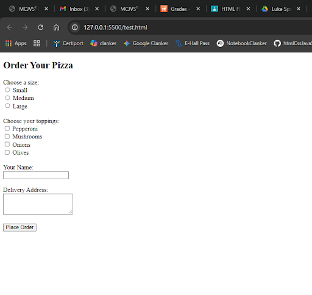

---

marp: true
theme: uncover
paginate: true
class: invert

---


# 🧠 HTML Flipped Classroom Project  
### Lesson : HTML lesson 05 
**Team Members:** Tyler, Luke, Michael F  
**Class:** Software Engineering & Web Development  

---

## 🎯 Learning Objectives
- Understand how form submission works with action and method
- Create forms with various input types
- Use HTML5 validation attributes
- Organize forms with fieldsets and legends

---

## 🧩 Introduction  
> In this lesson students will learn to understand and create forms with various input and submisson types. This is important as forms are an incredibly useful in gathering data online.

**Class Question:**  
💭 *Why do you think this topic is important for building websites?*

---

## 🧱 Key Concept #1 — Basic Form Structure
We will first look at the effect the action and method commands have on forms in HTML5.
```html
<!-- Basic form Structure -->
<form action="process.php" method="post">
  <!-- Put the form input here -->
  <button type ="submit">Submit Here</button>
  </form>
```
---
**Explanation:**
The Code creates a submit button.
Developers use it when they want to collect information, feedback, orders, or data from the users of their site.

---

## 💬 Quick Check

**Example:**
❓ What's the method type for sending requests to a specified resource? 
A) `PUT` B) `POST` C) `GET` D) `PATCH`

---

## 🧱 Key Concept #2 — multiple input types

See how you can add different forms of input into forms in HTML5!

Remember:
* #1: The browser will collect all submitted data based on the `name` attribute
* #2: The browser sends data to the URL specified in `<action>`

---
**Example:**
```html
<form action="process.php" method="post">
  <label for="name">Name:</label>
  <input type="text" id="name" name="name" required>
  <button type="submit">Submit</button>
</form>
```
---

🧩 **Class Activity:**
What type of input is being recorded here?.
```html
<form action="process.php" method="post">
  <label for="email">Enter your email:</label>
  <input type="email" id="email" name="email" required>
  <button type="submit">Submit</button>
  </form>
  ```

---

## 💡 Real-World Example

> This is most commonly used in google forms. As the name implies, it allows the user to create forms and share them with others.

---
```html

<form action="submit_order.php" method="post">
  <h2>Order Your Pizza</h2>

  <!-- Pizza Size -->
  <label for="size">Choose a size:</label><br>
  <input type="radio" id="small" name="size" value="Small" required>
  <label for="small">Small</label><br>
  <input type="radio" id="medium" name="size" value="Medium">
  <label for="medium">Medium</label><br>
  <input type="radio" id="large" name="size" value="Large">
  <label for="large">Large</label><br><br>

  <!-- Toppings -->
  <label>Choose your toppings:</label><br>
  <input type="checkbox" name="toppings[]" value="Pepperoni"> Pepperoni<br>
  <input type="checkbox" name="toppings[]" value="Mushrooms"> Mushrooms<br>
  <input type="checkbox" name="toppings[]" value="Onions"> Onions<br>
  <input type="checkbox" name="toppings[]" value="Olives"> Olives<br><br>

  <!-- Delivery Info -->
  <label for="name">Your Name:</label><br>
  <input type="text" id="name" name="name" required><br><br>

  <label for="address">Delivery Address:</label><br>
  <textarea id="address" name="address" rows="3" required></textarea><br><br>

  <!-- Submit -->
  <button type="submit">Place Order</button>
</form>
```

---
**Output of Previous Code**



---
## 🧠 Concept #3 — Required fields of input
This is for when a field has to be marked as required.

```html

<form action="submit.php" method="post">
  <input type="text" name="username" placeholder="Username" required />
  <button type="submit">Submit</button>
</form>
```

✅ Discuss how this builds on earlier concepts.
✅ Mention common mistakes or best practices.

---

## 💭 Class Interaction

**Question for Discussion:**

* How does this HTML element improve usability or accessibility? ```<form>```
* What might happen if this tag or attribute is missing?


---

## 🔍 Common Mistakes

| Mistake            | Why It Happens                | Fix                             |
| ------------------ | ----------------------------- | ------------------------------- |
| Typos when writing attributes | Frequent and repetitive text|  Verify code with your IDE          |
| Wrong or missing text in attributes       | Structural arrangement       | Parse code for phonetic bugs and errors |

---

## 🧪 Practice Example

```html
<form action="contact.php" method="post">
  <h2>Contact Us</h2>

  <!-- Name -->
  <label for="name">Full Name:</label><br>
  <input type="text" id="name" name="name" required><br><br>

  <!-- Email -->
  <label for="email">Email Address:</label><br>
  <input type="email" id="email" name="email" required><br><br>

  <!-- Subject -->
  <label for="subject">Subject:</label><br>
  <select id="subject" name="subject" required>
    <option value="">--Please choose an option--</option>
    <option value="feedback">Feedback</option>
    <option value="support">Support</option>
    <option value="general">General Inquiry</option>
  </select><br><br>

  <!-- Message -->
  <label for="message">Your Message:</label><br>
  <textarea id="message" name="message" rows="5" required></textarea><br><br>

  <!-- Submit -->
  <button type="submit">Send Message</button>
</form>
```


---
**Question:**

What will the browser display and why?


---

## 📝 Summary

* The key take-aways of this lesson are the importance of caution when creating forms in HTML5.
* The best practice is to always double check all of your code for errors and try to resolve them.
* Forms are highly versatile in HTML. Able to store and convey many kinds of data, and as such are a valuble skill to possess.
* Forms begin with the `<form>` tag and include attributes like **action** and **method**.

---

💬 **Exit Question:**
What’s one thing about this topic that surprised you?

---

## 🧮 Quiz Preview (for Team Quiz File)

1. What are the three attibutes needed to reference an HTML form?
2. What are input types and values used for?
3. How are input types and values connected?
4. What are the applications for HTML forms?
5. What are the two attributes needed to send a request with an HTML form?

---

## 🙌 Thank You!

**Team:** Tyler, Luke, Michael F  
**Lesson:** HTML lesson 05 
**Presented by:** [Team 5

> “Code it, teach it, and own it.”

